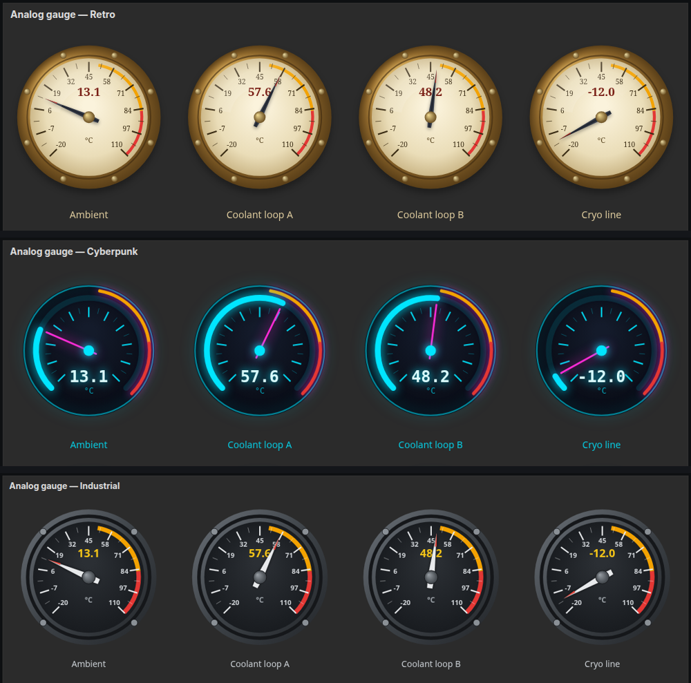

# Zabbix modules

Проект по созданию frontend-модулей Zabbix согласно документации
(`documentation/en/devel/modules`). Первый модуль — виджет дашборда **Item value card**.

**Структура репозитория:** `modules/` — «боевые» виджеты (`drawio`, `thermometer`,
`analog_gauge`); `examples/` — учебные примеры-заготовки (`example_item_card`,
`example_canvas`, `example_pattern`). В контейнере Zabbix модули должны лежать в
`/var/www/html/modules/…` независимо от того, где они на хосте (`modules/` или
`examples/`) — маунт задаёт соответствие `relative_path` (container-relative)
остаётся `modules/<id>`.

## Виджет `example_item_card` (Item value card)

Карточка последнего значения выбранного числового item:

- крупное число с единицами измерения;
- **цвет по порогам** (thresholds) — задаются в настройках виджета;
- индикатор тренда **▲/▼/=** — сравнение с предыдущим значением;
- необязательное описание.

### Структура

```text
examples/example_item_card/
  manifest.json                 метаданные, регистрация action и ассетов
  Widget.php                    Widget extends CWidget (переводы для JS)
  includes/WidgetForm.php       поля формы: item, show_trend, thresholds, description
  actions/WidgetView.php        контроллер: item.get + history.get (2 последних значения)
  views/widget.view.php         отдаёт данные в JS через setVar()
  views/widget.edit.php         форма настройки виджета
  assets/js/class.widget.js     WidgetExampleItemCard extends CWidget (отрисовка, цвет, тренд)
  assets/css/widget.css         стили карточки
```

Поток данных: `WidgetForm` (что настраивает пользователь) → `WidgetView` (доход до
данных через API) → `widget.view.php` (`setVar`) → `class.widget.js` (`setContents` рисует DOM).

## Окружение (Docker, Zabbix из исходников)

Используется образ `oscar120584/templator2-engine` — он компилирует Zabbix из исходников
при первом старте и поднимает PostgreSQL + server + agent + frontend (Apache/PHP) в одном
контейнере. Модуль монтируется внутрь UI как volume, поэтому правки видны сразу после
обновления страницы браузера.

### Запуск

```bash
docker run -d --name zbx-lesson \
  -p 8081:80 \
  -v "$PWD/examples/example_item_card:/var/www/html/modules/example_item_card" \
  oscar120584/templator2-engine:latest

# первый старт компилирует Zabbix (~2 мин); дождаться в логах "server #0 started"
docker logs -f zbx-lesson
```

Первый старт через `entrypoint` делает `chown -R www-data` по всему `/var/www/html`,
включая наш volume — вернуть владельца файлов на хосте:

```bash
docker exec zbx-lesson chown -R 1000:1000 /var/www/html/modules/example_item_card
```

(контейнер всё равно читает файлы: они world-readable 644/755).

Фронтенд: <http://localhost:8081>  (логин `Admin` / пароль `zabbix`).

### Регистрация модуля

В UI: *Administration → General → Modules → Scan directory*, затем *Enabled*.

Программно (через API master использует `Authorization: Bearer <token>`):

```bash
# login
TOKEN=$(curl -s -X POST http://localhost:8081/api_jsonrpc.php \
  -H 'Content-Type: application/json-rpc' \
  -d '{"jsonrpc":"2.0","method":"user.login","params":{"username":"Admin","password":"zabbix"},"id":1}' \
  | python3 -c 'import sys,json;print(json.load(sys.stdin)["result"])')

# register + enable
curl -s -X POST http://localhost:8081/api_jsonrpc.php \
  -H 'Content-Type: application/json-rpc' -H "Authorization: Bearer $TOKEN" \
  -d '{"jsonrpc":"2.0","method":"module.create","params":{"id":"example_item_card","relative_path":"modules/example_item_card","status":1},"id":2}'
```

## Демо

Создан дашборд **Item value card demo** (id 425) с виджетом на item *CPU utilization*
(пороги 20/50/80 → зелёный/оранжевый/красный):

<http://localhost:8081/zabbix.php?action=dashboard.view&dashboardid=425>

## Виджет `example_canvas` (Canvas playground)

Универсальная **заготовка виджета-«холста»** на native Canvas 2D. Идея: базовый класс
держит всю обвязку, а под новый виджет меняется только код перерисовки.

- `assets/js/class.widget.base.js` — `CWidgetCanvasBase` (не трогаем): создаёт canvas,
  масштабирует под devicePixelRatio, предзагружает картинки, гоняет цикл
  `requestAnimationFrame`, реагирует на resize, чистит ресурсы.
- `assets/js/class.widget.js` — `WidgetExampleCanvas` (переопределяет **только** `draw()`):
  фон + полупрозрачное кольцо + вращающаяся стрелка + текст поверх.
- `assets/img/` — bg/ring/arrow PNG (кольцо и стрелка с альфа-каналом).

URL картинок вычисляются во `views/widget.view.php` через
`(new CUrl($this->getAssetsPath().'/img/x.png'))->getUrl()` и передаются в JS через
`setVar('image_urls', …)`; база грузит их `new Image()` (same-origin, CSP ок).

Чтобы сделать **новый** canvas-виджет — наследуй `CWidgetCanvasBase` и напиши свой `draw()`:

```js
class WidgetMyThing extends CWidgetCanvasBase {
    isAnimated() { return true; }              // нужен ли кадровый цикл
    draw(ctx, {data, images, width, height, time}) {
        // рисуй здесь: ctx.drawImage(...), translate/rotate, globalAlpha, ctx.fillText(...)
    }
}
```

Демо-дашборд **Canvas playground demo** (id 426):
<http://localhost:8081/zabbix.php?action=dashboard.view&dashboardid=426>

## Виджет `example_pattern` (Pattern items — debug)

Показывает работу с **множеством айтемов на множестве хостов** через паттерны и фильтр
по тегам — то, чего не умеют штатные виджеты с прототипами. Пока это отладочный вывод:
список `хост — имя [key] = последнее значение` текстом.

Модель повторяет нативный *SVG graph* (`CSvgGraphHelper`):

- **Поля** (`includes/WidgetForm.php`): `CWidgetFieldPatternSelectHost`/`PatternSelectItem`
  (паттерны с `*`), `CWidgetFieldMultiSelectGroup`, `CWidgetFieldTags` +
  `CWidgetFieldRadioButtonList` (And/Or), `CWidgetFieldMultiSelectOverrideHost`.
  На **шаблонном** дашборде host/group-поля скрываются
  (`$this->isTemplateDashboard() ? null : …`).
- **Контроллер** (`actions/WidgetView.php`):
  - global: `API::Host()->get` по паттернам имён (`searchWildcardsEnabled` + `searchByAny`)
    → `hostids`, затем `API::Item()->get` с теми же wildcard-опциями + `tags` +
    `inheritedTags` (покрывает и теги хостов) + `webitems`;
  - template: `hostids = [override_hostid ?: templateid]` (данные текущего/дочернего хоста);
  - последнее значение каждого айтема читается **из истории** (`API::History()->get`).
- **JS** (`assets/js/class.widget.js`): `setContents()` выводит результат текстом в `<pre>`.

Демо-дашборд **Pattern items demo** (id 427):
<http://localhost:8081/zabbix.php?action=dashboard.view&dashboardid=427>

## Виджеты-гауджи: `analog_gauge` и `thermometer`

Два отдельных виджета на общей базе. Логика гауджа (значение из истории/демо, диапазон
fixed/auto, плавная анимация, формат, тема) вынесена в `CWidgetGaugeBase`
(`assets/js/class.gauge.base.js`, поверх `CWidgetCanvasBase`); конкретный виджет реализует
только `_drawGauge(ctx, scene)` (либо, для мульти-виджетов, переопределяет `draw()`
целиком). Обе базы — общие глобалы (`window.X ||= class …`), файлы идентичны в модулях.
Порядок `assets.js`: `class.widget.base.js` → `class.gauge.base.js` → `class.widget.js`.

Всё рисуется **процедурно** (градиенты/тени/трансформы) — картинки не нужны. Значение из
истории; без данных — демо-развёртка. Анимация — доводчик по `dt`.

**`analog_gauge`** — **мульти-виджет «сетка аналоговых манометров»** (переименован из
`manometer`; подробная документация:
[modules/analog_gauge/README.md](modules/analog_gauge/README.md), EN/RU/SR/PL/LV). Тот же
выбор данных, что у термометра (паттерн имени + хосты/группы + теги + макросы по хосту +
пороги), но раскладка **сеткой, без карусели**: каждый подходящий айтем — свой круглый
циферблат, число колонок подбирается автоматически (или фиксируется полем **Grid columns**).
Каждый циферблат плавно анимирует стрелку к своему значению; без данных — демо-развёртка.
Три оформления на выбор (**Style**): **Retro** (винтажная латунь), **Cyberpunk** (неон на
тёмном) и **Industrial** (стальной корпус с болтами). **Пороги** — цветные зоны на дуге
(цифровое значение и дуга-прогресс цвет по порогам не меняют); **Min/Max и пороги**
принимают **макросы**, раскрываемые
per-item по хосту (кастомное поле `CWidgetFieldGaugeThresholds`). Опционально стрелки
**слегка дрожат** (`Needle tremor` — только стрелка, не значение), а при заданном
**мин. размере циферблата** (`Min gauge size`) то, что не влезло в сетку, достаётся
**прокруткой мышью по обеим осям**. При наведении — подсказка с полным именем/хостом.



Демо (id 709, хост *Demo sensors* со script-айтемами, по странице на стиль + страница
«Grid + scroll»): <http://localhost:8081/zabbix.php?action=dashboard.view&dashboardid=709>

**`thermometer`** — **мульти-виджет «карусель»** (подробная документация: [modules/thermometer/README.md](modules/thermometer/README.md)). Айтемы выбираются паттерном
имени + хосты/группы паттерном + фильтр по тегам (модель SVG graph). Термометры стоят
в горизонтальный ряд, **каждый айтем — ровно один раз** (без зацикливания/размножения):
если все влезают — набор центрируется, иначе прокрутка ограничена [0, n−1]. Центральные —
в полный размер (несколько, если ширина позволяет), сфокусированный ещё чуть крупнее,
боковые ужимаются и гаснут у краёв («уход за кадр»). Значение — по **value_pos**
(off/top/bottom/left/right) + **Track** (маркер-«перо» у верхушки ртути). Имя
сфокусированного айтема — **плашка со стрелкой** вверх на его градусник; ниже точки-индикатор.
**Прокрутка**: перетаскиванием мыши (pointer-события, снап к ближайшему; в edit-mode drag
отдаётся дашборду) или **автоскроллом** «туда-обратно» (пинг-понг, `Auto-scroll cycle, s`,
плавно, 0=выкл; пауза при наведении). Диапазон **общий** для всех: fixed или auto
(`auto_min/auto_max` считает контроллер по объединённой истории всех айтемов, ±5%).

Один термометр (`_drawOne`): стекло, ртуть с клипом по трубке, min/max у границ прямой
части (купол/дно — «за диапазоном»), отметка **0** с базовой линией, без шарика ртуть от
нуля, целочисленная шкала (умный шаг), тема-независимость (`_isDark`).
**Трешхолды**: весь столбик ртути перекрашивается в цвет достигнутого порога (опционально
**интерполяция** цвета между порогами); цветные метки порогов на шкале. **Пользовательские
макросы** в Min/Max и порогах — раскрываются контроллером (`CMacrosResolverHelper`)
**per-item, по хосту каждого айтема** (один и тот же `{$MACRO}` на разных хостах даёт разные
значения → у каждого градусника своя шкала/пороги); кастомное поле
`CWidgetFieldThermoThresholds` (нативное отбрасывает нечисловые значения). Фокус на широком
виджете (когда всё влезает) переключается **наведением мыши**. Опции: **Range** fixed/auto,
**Decimals**, **Units (override)** (по умолчанию из item), **Show bulb**,
**Mercury color** (базовый цвет), **Thresholds** + **Interpolate**.
Демо (id 437, хост *Demo sensors* со script-айтемами): <http://localhost:8081/zabbix.php?action=dashboard.view&dashboardid=437>. Документация модуля — EN/RU/SR/PL/LV в [modules/thermometer/](modules/thermometer/README.md).

## Виджет `drawio` (Diagram — draw.io / SVG)

Вьювер **мнемосхемы draw.io / SVG**, которой управляет **один пользовательский скрипт**
(подробная документация: [modules/drawio/README.md](modules/drawio/README.md), EN/RU/SR/PL/LV).
Диаграмма остаётся *чистой и шаренбл* — в неё ничего не зашивается; вся логика живёт в
настройках виджета.


- **Чистый SVG.** Экспорт из draw.io (флаг `--embed-svg-fonts false`, иначе шрифты раздувают
  файл до ~115 КБ). Ячейки адресуются по `data-cell-id` из draw.io либо по видимой подписи
  (`cells.byLabel('eth0')`).
- **Один скрипт `(hosts, cells, api)`.** В него инжектятся хосты с `items`/`triggers` и их
  **тегами** + эффективные **пользовательские макросы** хоста (глобальные/шаблонные, с
  переопределениями) — матчинг по тегам/макросам вместо парсинга ключей; а также **CRUD над ячейками**:
  `get/byLabel/find/all` → handle `set(patch)`/`clone`/`repeat`/`remove`; `api` = `scale/color/grid`.
  Пользователь сам пишет логику (инструмент для продвинутых).
- **Песочница + защита от DoS.** Скрипт исполняется в изолированном `<iframe sandbox="allow-scripts">`
  (opaque origin — нет доступа к cookie/DOM/сети) с эвалуатором в **Worker** (зацикленный
  скрипт убивается сторожем). Скрипт не трогает DOM — его CRUD-вызовы записывают операции,
  а виджет применяет их к реальному SVG.
- **Чанкинг.** SVG и скрипт прозрачно бьются на строки `widget_field` (`diagram.0/.1/…`) —
  ни то, ни другое не ограничено 64 КБ.
- **LLD.** `cell.repeat(list, {cols, gap}, fn)` клонирует ячейку-шаблон под каждый айтем сеткой.
- **Анимация.** Плавные CSS-переходы значений на каждом рефреше + декларативные
  `set({animate:'pulse'|'blink'})` и `set({flow:<скорость>})` (бегущий пунктир по трубе) —
  крутит браузер, скрипт лишь включает.
- **Клон/удаление со связями.** `clone`/`repeat`/`remove` с опцией `edges` действуют и на
  линии-коннекторы к соседям (связность восстанавливается из геометрии SVG); клон узла сам
  протягивает свой коннектор к родителю.
- **Удобная форма.** Диаграмма загружается файлом с превью; поле скрипта — редактор
  CodeMirror с подсветкой, линтером и автодополнением id ячеек (запечён в модуль, работает
  офлайн). Скриншот — в [modules/drawio/README.md](modules/drawio/README.md#the-editing-form).

## Разработка

В контейнер смонтирована вся папка `modules/`, поэтому правь файлы локально и обновляй
страницу дашборда — изменения PHP/JS/CSS применяются сразу (кроме `manifest.json`: при
изменении состава action/ассетов может понадобиться пере-Scan / выключить-включить модуль).

**Добавить новый модуль:** создать `modules/<id>/…` и зарегистрировать через API
(`module.create` с `{id, relative_path:"modules/<id>", status:1}`) — пересоздавать
контейнер не нужно.

**Снимок окружения:** текущий контейнер запущен из образа `zbx-lesson:snap`
(`docker commit`), который хранит скомпилированный Zabbix + БД + регистрацию модулей +
дашборды. `docker stop/start zbx-lesson` ничего не теряет и не перекомпилирует.
