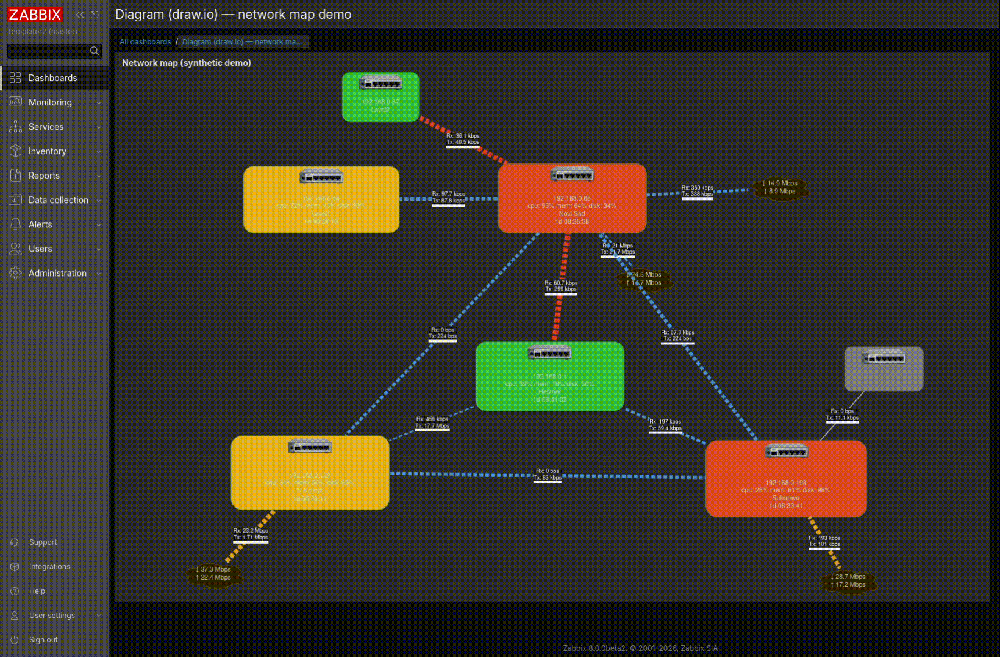
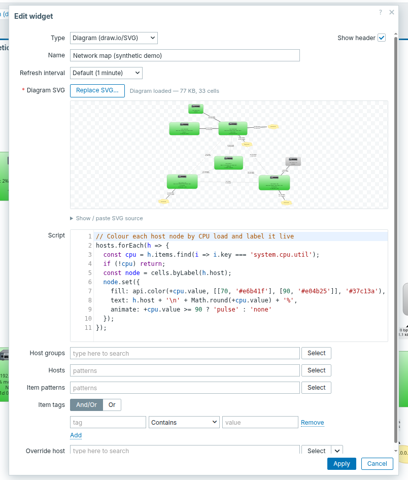

# Виджет «Диаграмма (draw.io / SVG)»

[English](README.md) | **Русский** | [Srpski](README.sr.md) | [Polski](README.pl.md) | [Latviešu](README.lv.md)

Виджет дашборда Zabbix, который отображает **диаграмму draw.io / SVG** и управляет
её элементами по данным мониторинга с помощью одного пользовательского скрипта.

Диаграмма остаётся *чистой и пригодной для обмена* — в неё ничего не зашивается.
Вся логика живёт в настройках виджета: один скрипт получает разрешённые хосты (с
айтемами и триггерами) и CRUD-API над ячейками диаграммы и делает что угодно
(перекрасить трубу по нагрузке, показать значение, клонировать шаблон под каждую
обнаруженную сущность…).

- **id модуля:** `drawio` · **namespace:** `Drawio` · **js class:** `WidgetDrawio`

---

## Демо — сетевая карта

[Сетевая карта](docs/netmap.drawio), полностью управляемая одним скриптом на
синтетических данных ([docs/netmap.demo.js](docs/netmap.demo.js)): заливка узла по
нагрузке, живые `cpu/mem/disk` (многострочные подписи), пульсация «горячего» узла,
серый **выключенный** хост, **бегущие** линии с толщиной по трафику и живой throughput
на облаках — всё вживую на дашборде. Экспортный SVG из draw.io тема-зависим
(`light-dark()`), поэтому нативно выглядит и в светлой теме Zabbix.



---

## Возможности

- Отрисовка любого SVG, экспортированного из draw.io (или написанного вручную), с
  адресацией ячеек по `data-cell-id` из draw.io.
- **Один скрипт** управляет всей диаграммой; вы получаете данные и CRUD-API и сами
  пишете логику (инструмент для продвинутых пользователей).
- В скрипт инжектятся **айтемы и триггеры** совпавших хостов, каждый со своими
  **тегами**; у каждого хоста есть и его собственные **теги и разрешённые
  пользовательские макросы** (глобальные + шаблонные, с применёнными
  переопределениями) — матчинг по тегам/макросам вместо парсинга ключей и имён.
- **Дружелюбно к LLD:** клонирование ячейки-шаблона под каждый обнаруженный айтем
  одним вызовом (`cell.repeat(...)`), с авто-раскладкой сеткой.
- **Знает о связях:** клонировать или удалять ячейку можно **вместе с линиями,
  которые связывают её с соседями** — связность восстанавливается из геометрии SVG,
  так что клон узла сам протягивает свой коннектор к родителю.
- **Анимация:** значения плавно перетекают при каждом рефреше, а ячейки могут
  нести анимацию, которую крутит браузер (`pulse` / `blink` или бегущий пунктир
  по трубе) — скрипт лишь переключает её, поэтому в песочнице ничего не зациклено.
- **Чанкированное хранение:** SVG и скрипт прозрачно разбиваются на несколько строк
  `widget_field`, поэтому ни то, ни другое не ограничено 64 КБ.
- **Песочница и защита от DoS:** скрипт исполняется в изолированном iframe + Worker —
  нет доступа к cookie/DOM/сети с учётными данными, а зацикленный скрипт убивается.
- **Ассистированное редактирование:** диаграмма загружается файлом с живым
  предпросмотром, а поле скрипта — редактор CodeMirror с подсветкой синтаксиса,
  линтером и автодополнением id ячеек диаграммы — всё вендорится, работает офлайн.

---

## Установка

Скопируйте модуль в `modules/drawio` фронтенда Zabbix и зарегистрируйте его
(Administration → General → Modules → *Scan directory* → включить) либо через API:

```json
{"jsonrpc":"2.0","method":"module.create",
 "params":{"id":"drawio","relative_path":"modules/drawio","status":1},
 "id":1}
```

---

## Подготовка диаграммы

Нарисуйте диаграмму в [draw.io / diagrams.net](https://app.diagrams.net) и
**экспортируйте в SVG**. Важны две вещи:

1. **Отключите встраивание шрифтов.** По умолчанию draw.io встраивает шрифты, и SVG
   раздувается (даже простая схема может занять ~115 КБ). Без шрифтов — несколько КБ.
   В desktop-CLI:

   ```bash
   drawio-export -f svg --embed-svg-fonts false -e -o out diagram.drawio
   ```

   (`-e` дополнительно встраивает копию исходника, чтобы экспортный SVG снова
   открывался в draw.io.)

2. **id ячеек.** Современный draw.io пишет `data-cell-id="<mxCell id>"` на `<g>`-обёртке
   каждой ячейки — так скрипт адресует элементы. Эти id — непрозрачные авто-id
   (например, `1Y4-VilqHyjT-noTrS5i-97`); можно также искать ячейку по видимой
   **подписи** (`cells.byLabel('eth0')`), что обычно удобнее.

3. **Светлая / тёмная тема.** draw.io экспортирует тема-зависимые цвета как
   CSS-функцию `light-dark(тёмный, светлый)` и проставляет `color-scheme: light dark`
   на `<svg>` — из-за чего сам по себе SVG следует за темой **ОС**, а не Zabbix.
   Виджет это исправляет: читает активную схему из атрибута `<html color-scheme>`,
   который выставляет Zabbix, и форсит её на SVG — так автоматические цвета диаграммы
   (текст, подписи, градиенты) совпадают со светлой или тёмной темой интерфейса.
   На практике:

   - Держите **текст и подписи на автоматическом цвете** draw.io (не переопределяйте
     цвет шрифта) — тогда они читаемы в обеих темах.
   - Цвета, заданные **явно** — фиксированная заливка/обводка в диаграмме или hex из
     `set({fill: '#e05050'})` в скрипте — буквальны и одинаковы в обеих темах. Обычно
     это как раз то, что нужно для статусных цветов (красный = перегрев независимо от темы).
   - Проверить обе темы до деплоя можно тумблером в
     [`tools/preview.mjs`](tools/README.md).

Загрузите полученный SVG в поле виджета **Diagram SVG** — выберите файл (появится
предпросмотр) или вставьте исходник.

---

## Настройка

| Поле | Назначение |
|------|------------|
| **Diagram SVG** | экспортный SVG (обязательное, чанкируется) |
| **Script** | пользовательский скрипт, управляющий диаграммой (чанкируется) |
| **Host groups / Hosts** | выбор хостов паттернами (на глобальных дашбордах) |
| **Item patterns** | какие айтемы разрешать и инжектить |
| **Item tags** | фильтр по тегам (And/Or) |
| **Override host** | динамический/override-хост для шаблонных дашбордов |

### Форма редактирования



- **Diagram** — выберите экспортированный файл `.svg` вместо вставки текста; форма
  показывает миниатюру-предпросмотр и сводку `… KB, N cells`. Исходный SVG остаётся
  доступен под *Show / paste SVG source* для ручной правки.
- **Редактор скрипта** — редактор CodeMirror с подсветкой синтаксиса JavaScript,
  линтером (синтаксические ошибки отмечаются на полях), подсветкой и автозакрытием
  скобок.
- **Автодополнение id** — внутри `cells.get('…')` / `cells.byLabel('…')` редактор
  подсказывает **id и подписи ячеек, разобранные из загруженного SVG**; в остальных
  местах предлагает поверхность `cells` / `api`. В любой момент нажмите `Ctrl-Space`.

CodeMirror вендорится внутри модуля (`assets/*/vendor`) и загружается только пока
форма открыта, поэтому полностью работает офлайн и ничего не добавляет к другим
страницам.

---

## Скрипт

Контракт — тело скрипта исполняется как `(hosts, cells, api)`:

### `hosts`
```js
[
  { host: 'Router A', hostid: '10105', tags: [ { tag, value }, … ],
    macros: { '{$SNMP_COMMUNITY}': 'public', '{$TEMP.CRIT}': '85', … },
    items:    [ { key, name, value, units, value_type, clock, tags: [ { tag, value }, … ] }, … ],
    triggers: [ { triggerid, description, priority, status, value, tags: [ { tag, value }, … ] }, … ] }
]
```

`macros` — это **эффективные** пользовательские макросы хоста по имени: включены
глобальные + шаблонные, переопределения хоста/шаблона уже применены (те же значения,
что показывает форма редактирования хоста). Секретные макросы значения не несут.

```js
// напр. взять порог из макроса хоста вместо жёсткого числа:
const crit = +hosts[0].macros['{$TEMP.CRIT}'] || 80;
```

### `cells` — поиск элементов диаграммы

`cells` ищет адресуемые элементы диаграммы (любой `<g data-cell-id>`). Каждый поиск
возвращает **handle** (или `null`) — через handle вы читаете и меняете элемент.

#### `cells.get(id)` → `handle | null`
Найти ячейку по её `data-cell-id`.

- **`id`** `string` — id ячейки (`mxCell` id из draw.io или заданный вами в диаграмме).
- Возвращает handle или `null`, если ячейки с таким id нет.

#### `cells.byLabel(text)` → `handle | null`
Найти первую ячейку, чья видимая подпись равна `text` (точное совпадение, пробелы схлопнуты).

- **`text`** `string` — подпись для поиска.

#### `cells.find(fn)` → `handle | null`
Найти первую ячейку, для которой `fn` вернул истину.

- **`fn`** `(cell) => boolean` — предикат; `cell` — простой дескриптор `{ id, label, bbox, neighbors, source, target }` (не handle).

#### `cells.all` → `handle[]`
Handle для каждой адресуемой ячейки диаграммы.

### Handle ячейки

Handle даёт идентичность/геометрию ячейки (только чтение) и методы, которые её меняют.

**Свойства**

- **`handle.id`** `string` — `data-cell-id` ячейки.
- **`handle.label`** `string` — текст видимой подписи (из `foreignObject`/`text` ячейки, пробелы схлопнуты; `''`, если подписи нет).
- **`handle.bbox`** `{ x, y, width, height }` — ограничивающий прямоугольник в пользовательских единицах SVG.
- **`handle.neighbors`** `string[]` — id ячеек, с которыми эта связана коннектором (восстановлено из геометрии).
- **`handle.source`** `string | null` — для **коннектора** id узла у **начала** линии, ровно как нарисовано (draw.io *source*; `null`, если этот конец не прицеплен к узлу).
- **`handle.target`** `string | null` — для **коннектора** id узла у **конца** линии (draw.io *target*; `null`, если не прицеплен). У не-коннекторов оба `null`. Вместе дают **направление из самого чертежа** — разверни стрелку в draw.io, и `flow` последует, не нужно зашивать порядок концов.

#### `handle.set(patch)` → `handle`
Применить визуальные изменения. Трогаются только переданные ключи, остальное — как
было. Возвращает тот же handle (можно чейнить). **Липкое:** свойство держится между
рефрешами, пока вы его не смените — сбрасывайте явно, когда условие спало
(`animate: 'none'`, `flow: 0`).

- **`patch`** `object` — любое подмножество:

  | Поле | Тип | Действие |
  |------|-----|----------|
  | `fill` | цвет | Заливка фигур ячейки. |
  | `stroke` | цвет | Цвет обводки / линии. |
  | `strokeWidth` | number | Толщина обводки / линии, px. |
  | `opacity` | number `0`–`1` | Прозрачность всей ячейки. |
  | `text` | string | Заменить подпись; `\n` — перенос строк. |
  | `textAngle` | number \| `'edge'` | Повернуть подпись на N°, либо `'edge'` = параллельно линии-коннектору (с автофлипом, чтобы текст не был вверх ногами). |
  | `animate` | `'pulse'` \| `'blink'` \| `'none'` | Анимация ячейки, которую крутит браузер. |
  | `flow` | number | Бегущий пунктир по линиям ячейки: знак = направление (**положительный идёт `source`→`target`**, как нарисовано), модуль = скорость, `0`/`false` = стоп. |

  **цвет** — CSS-строка цвета либо 6 hex-цифр с `#` или без (`'#e05050'` = `'e05050'`).

#### `handle.clone(opts)` → `handle`
Дублировать ячейку со смещением; возвращает handle нового клона.

- **`opts.id`** `string` *(необяз.)* — id клона; генерируется автоматически, если не задан.
- **`opts.dx`, `opts.dy`** `number` *(необяз., деф. `0`)* — смещение в единицах SVG.
- **`opts.patch`** `object` *(необяз.)* — патч `set()`, применяемый к клону.
- **`opts.edges`** `true | string[]` *(необяз.)* — также клонировать коннекторы, инцидентные исходнику (см. **edges** ниже).

#### `handle.repeat(list, opts, fn)` → `undefined`
Клонировать ячейку под каждый элемент списка и разложить клоны сеткой, вызвав `fn` на
каждом. Слот 0 — сам шаблон на месте; слоты 1…n — клоны.

- **`list`** `array` — по одной ячейке на элемент.
- **`opts.cols`** `number` *(деф. `4`)* — колонок в сетке.
- **`opts.gap`** `number` *(деф. `12`)* — зазор между плитками, единицы SVG.
- **`opts.edges`** `true | string[]` *(необяз.)* — клонировать и коннекторы каждой плитки (см. **edges**).
- **`fn`** `(cell, item, i) => void` — вызывается на каждой плитке: `cell` = handle плитки, `item` = элемент списка, `i` = индекс.

#### `handle.remove(opts)` → `undefined`
Удалить ячейку из диаграммы.

- **`opts.edges`** `true | string[]` *(необяз.)* — удалить и инцидентные коннекторы (см. **edges**).

**`edges`** (у `clone` / `repeat` / `remove`): `true` = все коннекторы, касающиеся
ячейки; `[neighborId, …]` = только линии, дальний конец которых приходит в этих
соседей. При клонировании каждый коннектор перекладывается прямой линией — дальний
конец на месте, ближний следует за клоном — поэтому веер клонов сохраняет каждый свою
линию к общему родителю. Связность выводится из геометрии SVG (встроенная модель
draw.io не нужна); маршрутные изломы становятся прямыми.

### `api` — функции-хелперы

Чистые функции, доступные внутри скрипта (без побочных эффектов).

#### `api.scale(v, inMin, inMax, outMin, outMax)` → `number`
Линейное отображение из одного диапазона в другой, **с клампом** к выходному диапазону
(никогда не выходит за него). Напр. `api.scale(75, 0, 100, 2, 12)` → `9.5`.

- **`v`** `number` — входное значение.
- **`inMin`, `inMax`** `number` — входной диапазон (если равны, доля считается `0`).
- **`outMin`, `outMax`** `number` — выходной диапазон.

#### `api.color(v, thresholds, base)` → `цвет`
Выбрать цвет по порогу — цвет **наибольшего порога `≤ v`**. Напр.
`api.color(83, [[50,'#e0b000'],[80,'#e05050']], '#3fa34d')` → `'#e05050'`.

- **`v`** `number` — проверяемое значение.
- **`thresholds`** `[number, цвет][]` — пары `[порог, цвет]` в любом порядке (внутри сортируются по возрастанию).
- **`base`** `цвет` — возвращается, когда `v` ниже всех порогов.

#### `api.grid(i, opts)` → `{ dx, dy }`
Смещение сетки для *i*-й плитки — ручная альтернатива авто-раскладке `repeat`.

- **`i`** `number` — индекс плитки (с 0).
- **`opts.cols`** `number` *(деф. `4`)* — колонки.
- **`opts.gap`** `number` *(деф. `12`)* — зазор, единицы SVG.
- **`opts.w`, `opts.h`** `number` *(деф. `130` / `70`)* — ширина / высота плитки.
- Возвращает смещение `{ dx, dy }`, напр. для передачи в `clone`.

#### `api.units(v, unit, decimals)` → `string`
Форматировать число как это делает Zabbix. **Байты** (`B`, `Bps`) масштабируются по
**1024**, всё остальное — включая **биты** (`bps`, `b`) — по **1000**; хвостовые нули
убираются. Спец-юниты диспетчеризуются как в Zabbix: `uptime`/`s` → длительность,
`unixtime` → дата-время, `%`/`ms`/`rpm`/`RPM` → без масштаба. Поэтому `item.units`
можно передавать напрямую.

- **`v`** `number` — значение.
- **`unit`** `string` — юнит Zabbix (`'B'`, `'Bps'`, `'bps'`, `'%'`, `'s'`, `'uptime'`, `'unixtime'`, …); `''` для обычного числа.
- **`decimals`** `number` *(необяз., деф. `2`)* — макс. знаков после запятой.
- Примеры: `api.units(1536,'B')` → `"1.5 KB"`, `api.units(2500000,'bps')` → `"2.5 Mbps"`, `api.units(174820,'uptime')` → `"2 days, 00:33:40"`, `api.units(3661,'s')` → `"1h 1m 1s"`.

### Примеры

**Цвет по порогу + текст значения:**
```js
const it = {};
hosts.forEach(h => h.items.forEach(i => it[i.key] = i));

const r = it['demo.reactor'];
if (r) cells.get('reactor').set({
  fill: api.color(+r.value, [[50, '#e0b000'], [80, '#e05050']], '#3fa34d'),
  text: (+r.value).toFixed(1) + ' °C'
});
```

**Толщина линии по нагрузке канала:**
```js
const net = it['net.if.in[eth0]'];
if (net) cells.byLabel('eth0').set({ strokeWidth: api.scale(+net.value, 0, 1e9, 2, 16) });
```

**LLD — клонирование шаблона под каждый обнаруженный айтем:**
```js
const nums = hosts.flatMap(h => h.items).filter(i => i.value != null && !isNaN(+i.value));

cells.get('tmpl').repeat(nums, { cols: 4, gap: 12 }, (cell, item) => {
  const x = +item.value;
  cell.set({
    fill: api.color(x, [[40, '#e0b000'], [70, '#e05050']], '#2b7a3d'),
    text: item.name + ': ' + x.toFixed(1) + '°C'
  });
});
```

**Матчинг по тегу вместо ключа:** у каждого айтема, триггера и хоста есть `tags`.

```js
const tagged = (host, name) => host.items.find(i => i.tags.some(t => t.tag === 'port' && t.value === name));

hosts.forEach(h => {
  const up = tagged(h, 'wan');
  if (up) cells.byLabel('WAN').set({ strokeWidth: api.scale(+up.value, 0, 1e9, 2, 16) });
});
```

**Клонировать шаблон вместе с коннектором к родителю (LLD-веер):**

```js
// 'node' — ячейка-шаблон, связанная линией с 'core'. Каждый клон получает свою
// линию к 'core'; слот 0 — сам шаблон на месте (его линия уже есть).
const nums = hosts.flatMap(h => h.items).filter(i => !isNaN(+i.value));

cells.get('node').repeat(nums, { cols: 4, gap: 20, edges: ['core'] }, (cell, item) => {
  cell.set({ text: item.name, fill: api.color(+item.value, [[70, '#e05050']], '#2b7a3d') });
});
```

### Анимация

Два поля `patch` навешивают анимацию, которую крутит **браузер**. Скрипт задаёт их
один раз за рефреш; браузер держит их живыми между рефрешами, поэтому в песочнице
ничего не зацикливается (гарантия от DoS не нарушается). Вдобавок любое изменение
значения уже **плавно перетекает** (fill/stroke/stroke-width/opacity, ~0.6 с) —
труба сама «толстеет», цвет переливается.

- `animate: 'pulse' | 'blink' | 'none'` — пульсация (плавно) или мигание (шагом)
  всей ячейки; `'none'` (или отсутствие) выключает.
- `flow: <число со знаком>` — бегущий пунктир по линиям ячейки. **Положительное**
  значение идёт от `source` к `target` линии — в ту сторону, как она нарисована
  (см. `handle.source` / `handle.target`), отрицательное разворачивает; величина —
  скорость; `0`/`false` останавливает.
- `textAngle: <градусы> | 'edge'` — повернуть подпись ячейки. `'edge'` кладёт её
  **параллельно линии-коннектору** (угол берётся из геометрии линии, с флипом чтобы
  текст не был вверх ногами) — удобно для подписей на ребре, например `Rx/Tx`.

```js
// Ячейка-авария пульсирует, пока триггер в состоянии PROBLEM.
const problem = hosts.some(h => h.triggers.some(t => t.value === '1'));
cells.byLabel('pump').set({ animate: problem ? 'pulse' : 'none' });

// Пунктир бежит по трубе, быстрее при росте нагрузки канала.
const net = it['net.if.in[eth0]'];
if (net) cells.byLabel('eth0').set({ flow: api.scale(+net.value, 0, 1e9, 0.3, 4) });
```

> Поскольку реальный SVG сохраняется между рефрешами, анимация остаётся включённой,
> пока скрипт её не выключит — всегда задавай «выключающую» ветку (`animate:'none'`,
> `flow:0`), когда условие перестало выполняться.

### Отладка

Скрипт — обычный JavaScript, исполняемый браузером, поэтому доступна вся мощь
devtools — с двумя нюансами:

- Он исполняется внутри Worker'а песочницы, поэтому в **Sources** отображается как
  `blob:`/VM-запись. `console.log(...)` из скрипта пишет в консоль, а инструкция
  `debugger;` останавливает исполнение там же.
- Эвалуатор ловит исключения скрипта, чтобы сохранить изоляцию, поэтому
  необработанная ошибка иначе пропала бы. Виджет пробрасывает её в консоль как
  `[drawio] user script error: <stack>` — а операции, записанные до выброса,
  всё равно применяются.

---

## Как это работает

1. Контроллер разрешает выбранные айтемы (последнее значение из истории) и триггеры
   их хостов, группирует в `hosts` и возвращает вместе с SVG и скриптом.
2. Фронтенд инжектит SVG, строит сериализованную модель ячеек (`{id, label, bbox}` на
   каждую ячейку) и передаёт её вместе с данными и скриптом в песочницу.
3. Песочница исполняет скрипт; его CRUD-вызовы **записывают операции**
   (`set` / `clone` / `remove`).
4. Виджет применяет эти операции к реальному SVG.

Скрипт никогда не трогает DOM напрямую — он работает с сериализованной моделью и
возвращает операции, что и делает его пригодным для песочницы.

---

## Чанкинг

`Diagram SVG` и `Script` хранятся через `CWidgetFieldChunkedText`, который разбивает
значение (по границам символов, под байтовый лимит колонки) на `diagram.0`,
`diagram.1`, … и собирает обратно при загрузке. Диаграммы и скрипты имеют свойство
расти, поэтому чанкинг встроен сразу, а не добавлен по факту упора в лимит.

---

## Модель безопасности

Пользовательские скрипты — это произвольный JavaScript, написанный тем, кто может
редактировать дашборд. Они исполняются в **изолированном `<iframe sandbox="allow-scripts">`**
(без `allow-same-origin` → opaque origin), а эвалуатор размещён в **Worker** внутри
этого iframe:

- **Конфиденциальность** — opaque origin блокирует доступ к cookie родителя, DOM и
  запросам с учётными данными. Проверено: из песочницы `parent.location.href` и
  `parent.document.cookie` оба бросают `SecurityError`.
- **Доступность (DoS)** — скрипт бежит в собственном потоке Worker'а; сторож убивает
  его через ~1 с, так что бесконечный цикл не может заморозить дашборд. Проверено:
  скрипт `while(true){}` оставляет страницу полностью отзывчивой, а диаграмму —
  без применённых изменений.

Если браузер отказывается создавать Worker внутри sandbox-фрейма, виджет откатывается
на инлайн-исполнение (изоляция сохраняется, но без гарантии от DoS).

> Примечание: это инструмент для продвинутых пользователей. Соответственно ограничьте
> круг тех, кто может редактировать такие дашборды.
