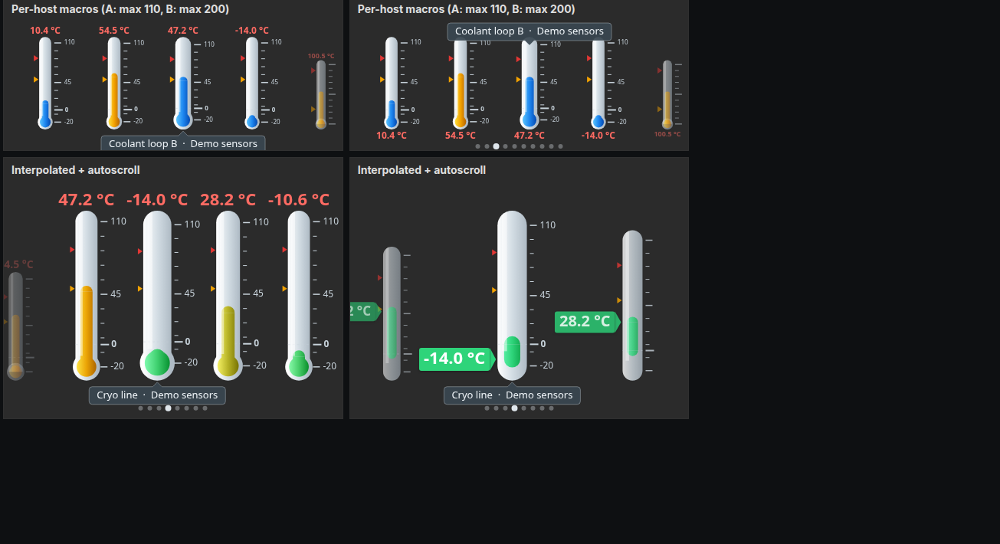
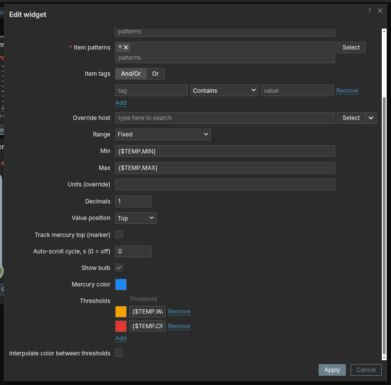

# Thermometer (canvas) — виджет дашборда Zabbix

[English](README.md) | **Русский** | [Srpski](README.sr.md) | [Polski](README.pl.md) | [Latviešu](README.lv.md)

Мульти-виджет «карусель термометров». Отображает значения нескольких айтемов
(выбранных паттерном имени и отфильтрованных по тегам) в виде ряда стеклянных
термометров: центральный крупнее и в фокусе, боковые меньше и уходят «за кадр».
Всё рисуется процедурно на `<canvas>` (без картинок-ассетов).



- **id:** `thermometer` · **namespace:** `Thermometer` · **type:** `widget`
- Класс отрисовки: `WidgetThermometer` (наследует общую базу `CWidgetGaugeBase` →
  `CWidgetCanvasBase`).

## Возможности

- Несколько айтемов на нескольких хостах — выбор **паттерном** имени (wildcards `*`),
  фильтр по **тегам** (модель нативного *SVG graph*, `inheritedTags` учитывает и теги
  хостов). Показываются **только числовые** айтемы (float / unsigned); текст, лог и
  символьные отсекаются.
- **Карусель**: каждый выбранный айтем показывается **ровно один раз** — айтемы никогда не
  дублируются, чтобы заполнить широкий виджет. Если все помещаются, набор центрируется;
  иначе карусель прокручивается (ограниченно, без зацикливания). Центральные термометры —
  в полный размер (несколько, если ширина позволяет), сфокусированный чуть крупнее; боковые
  ужимаются и плавно гаснут у краёв.
- **Трешхолды (пороги)**: **весь столбик ртути** перекрашивается в цвет самого высокого
  достигнутого порога (а не только часть выше него). При включённой **интерполяции** цвет
  плавно перетекает между порогами — и от базового цвета ртути ниже первого порога — по мере
  изменения значения. Небольшие цветные метки показывают уровни порогов на шкале.
- **Пользовательские макросы**: значения **Min**, **Max** и порогов могут быть макросами
  (например, `{$TEMP.MAX}`, `{$WARN}`). Резолвятся **для каждого айтема против его
  собственного хоста** — один и тот же макрос может дать разное число на разных хостах, так
  что каждый термометр рисуется со своей шкалой и своими уровнями порогов.
- **Значение** на каждом термометре по `value_pos` (сверху/снизу/слева/справа/выкл),
  режим **Track** — маркер-«перо самописца» у верхушки ртути (для left/right ряд
  автоматически раздвигается, чтобы перо помещалось).
- **Имя** сфокусированного айтема — плашка со стрелкой, указывающей на его термометр;
  ниже — точки-индикатор позиции.
- **Прокрутка**: перетаскиванием мыши (снап к ближайшему) или **автоскроллом**
  (плавное качание туда-обратно, «пинг-понг», без зацикливания, с паузой при наведении курсора).
- **Общий диапазон** для всех айтемов: фиксированный или авто (по объединённой истории
  всех выбранных айтемов, с запасом ±5%).
- Естественность отрисовки: шкала целыми числами (умный шаг), всегда отмечает **0**
  (если он в диапазоне) с базовой линией, min/max привязаны к прямой части трубки
  (купол и дно — «за диапазоном»), без шарика ртуть рисуется от нуля (вниз при
  отрицательных). Цвета шкалы и значения тема-независимы (светлая/тёмная тема).

## Параметры



| Параметр | Тип | По умолч. | Описание |
|----------|-----|-----------|----------|
| **Host groups** ¹ | мультиселект групп | — | Ограничить хосты группами. Только на глобальном дашборде. |
| **Hosts** ¹ | паттерны хостов | — | Паттерны имён хостов (wildcards `*`). Только на глобальном дашборде. |
| **Item patterns** | паттерны айтемов | — (обязательно) | Паттерны имён айтемов (wildcards `*`). Резолвятся в набор айтемов. |
| **Item tags** | evaltype + строки тегов | And/Or | Фильтр по тегам айтемов (учитываются и наследованные теги хостов). |
| **Override host** | мультиселект | — | Переопределение хоста (для динамического/шаблонного контекста). |
| **Range** | select | Fixed | `Fixed` — из полей Min/Max; `Auto (shared, history ±5%)` — общий диапазон по объединённой истории всех айтемов. |
| **Min** / **Max** | число или макрос ² | 0 / 100 | Границы шкалы для режима Fixed. Может быть пользовательским макросом (например, `{$TEMP.MIN}`). |
| **Units (override)** | строка | — | Единицы измерения. Пусто → берутся из самого item. |
| **Decimals** | целое 0–10 | 1 | Знаков после запятой у значения. |
| **Value position** | select | Top | Где показывать значение: `Off` / `Top` / `Bottom` / `Left` / `Right`. |
| **Track mercury top (marker)** | флажок | выкл | Значение как маркер-«перо» у верхушки ртути (для `Left`/`Right`). |
| **Auto-scroll cycle, s (0 = off)** | целое 0–3600 | 0 | Секунд на полное качание туда-обратно. `0` — автоскролл выключен. Пауза при наведении. |
| **Show bulb** | флажок | вкл | Рисовать колбу-шарик внизу. Без шарика ртуть рисуется от нуля. |
| **Mercury color** | цвет | `D81B18` | Базовый цвет ртути (ниже первого порога). Градиент строится из этого цвета. |
| **Thresholds** | строки цвет + значение ² | — | Перекрашивать весь столбик ртути при достижении значением порога. Каждое значение может быть пользовательским макросом. |
| **Interpolate color between thresholds** | флажок | выкл | Плавно перетекающий цвет ртути между порогами вместо переключения ступенями. |

¹ На **шаблонном** дашборде поля *Host groups* и *Hosts* скрыты — айтемы резолвятся против
текущего/переопределённого хоста.

² **Пользовательские макросы** в *Min*, *Max* и *Thresholds* — одна общая настройка, но
резолвятся они **для каждого айтема — против его собственного хоста**, поэтому один и тот же
макрос может дать разное число на разных хостах, и каждый термометр сохраняет свою
шкалу/пороги. (На *шаблонном* дашборде выбор ограничен одним хостом, так что это неактуально.)

## Управление

- **Перетаскивание мышью** влево/вправо — прокрутка карусели; при отпускании — снап к
  ближайшему термометру. В режиме редактирования дашборда перетаскивание отдаётся дашборду.
- **Автоскролл** (`Auto-scroll cycle`) — плавно прокручивает айтемы туда-обратно
  (пинг-понг, без зацикливания); **пауза, пока курсор над виджетом**. Когда все айтемы
  помещаются в виджете, прокручивать нечего.
- **Фокус** — **наведите курсор** на любой термометр, чтобы сфокусировать его: он немного
  увеличивается, становится ярче (не гаснет у края) и появляется плашка с его именем. Это
  работает и когда всё помещается, и пока карусель прокручивается, так что сфокусировать и
  показать имя можно даже у крайних айтемов. Без наведения сфокусирован средний. (Когда
  значение показывается снизу, плашка с именем переезжает наверх, чтобы не закрывать значения.)

## Структура модуля

```text
thermometer/
  manifest.json                 id/namespace/js_class, action, ассеты
  includes/WidgetForm.php       поля формы (паттерны, теги, отображение, пороги)
  includes/CWidgetFieldThermoThresholds.php  поле порогов, принимающее и пользовательские макросы
  actions/WidgetView.php        резолвинг айтемов по паттерну+тегам, значения из истории,
                                общий auto_min/auto_max, резолвинг макросов в min/max/порогах
  views/widget.view.php         setVar(items, auto/range min/max, пороги, fields_values)
  views/widget.edit.php         форма настройки
  assets/js/class.widget.base.js  CWidgetCanvasBase (общая canvas-обвязка, assign-once глобал)
  assets/js/class.gauge.base.js   CWidgetGaugeBase (значение/диапазон/анимация/тема)
  assets/js/class.widget.js       WidgetThermometer (карусель, отрисовка, drag/autoscroll)
  assets/css/widget.css           стили canvas
  docs/                           скриншоты для этого README
```

## Установка

Скопировать каталог `thermometer` в `zabbix/ui/modules/`, затем зарегистрировать:
*Administration → General → Modules → Scan directory* и включить модуль. Виджет появится
в списке типов при добавлении на дашборд.
